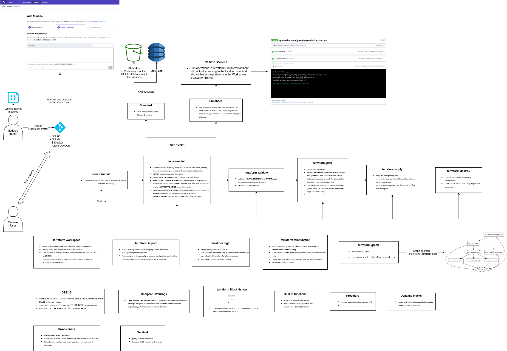

# terraform-associate-study

In order to study to pass the Terraform associate exam I created a visual map which I believe that might help as a review resource for people who are studying to take the exam.

Every block has some concept/command realated to a exam question that a saw in my exam day (2020/06), I really encourage to read more about it in the documentation in case you are not confortable about what it does, how to use it and where to use it. The exam will demand some usage knowledge and experience with commands.

It is a complement to [Study guide](https://learn.hashicorp.com/terraform/certification/terraform-associate-study-guide) and [review guide](https://learn.hashicorp.com/terraform/certification/terraform-associate-review).

# IMPORTANT
This image does not contain everything needed to take the exam. It is just a visual map that I did when I was studying to the exam and that I updated after it. It is not oficial and does not replace the oficial documentation from Hashicorp. 